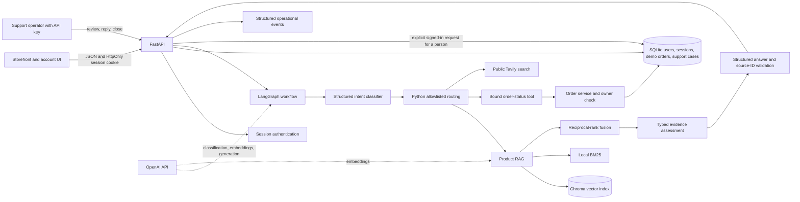
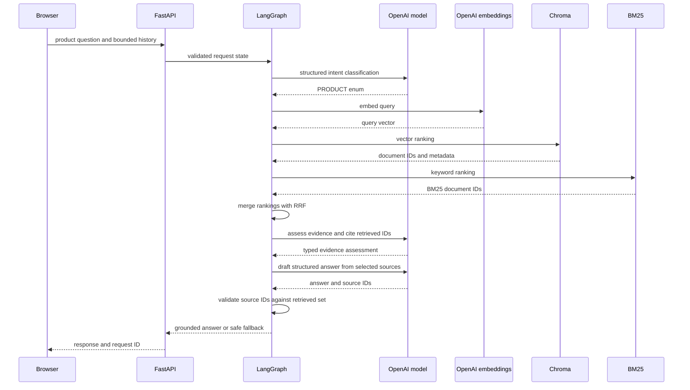
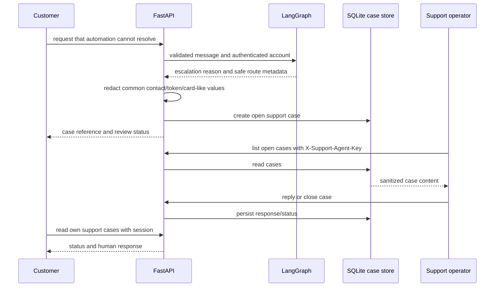

# Koivu Store AI Agent: architecture design

## 1. System purpose

Koivu Store demonstrates a Finnish storefront with an AI-assisted product-support workflow. It shows where semantic interpretation and language generation help, while Python and the database enforce routing, identity, permissions, validation, and persistence.

The account, order, and support features use local demo data. The application is not a payment platform or a production commerce backend.

## 2. Design principles

- **LLM vs deterministic logic:** the model classifies intent, assesses evidence, and drafts Finnish responses. Python maps only known intent values to graph nodes, validates source IDs, decides whether a route is permitted, and handles account/session/order/support behavior.
- **Least privilege:** the product and web paths never receive order tools. The order path exposes one lookup capability with an authenticated owner ID bound by the API.
- **Backend authorization:** database ownership queries filter by both order ID and user ID. A prompt, tool argument, or conversation-history entry cannot replace that identity.
- **Safe tool calling:** the order tool takes one validated order reference and returns a narrow status result. It has no SQL execution, listing, payment, or mutation capability.
- **Grounding:** evidence and answer outputs use typed schemas. The API accepts source IDs only when they came from current retrieval results. Unsupported or malformed output falls back to clarification or human review.
- **Human-in-the-loop:** a signed-in customer gets a persisted support case only after explicitly asking for a person. Ordinary uncertainty, product gaps, and style advice do not create cases.
- **Privacy by design:** passwords are hashed, session tokens are opaque and stored as digests, logs omit message contents, and support-case text is redacted before persistence.
- **Observability and evaluation:** request IDs, route/tool outcomes, duration, and provider token counts are logged. Unit tests and labelled datasets cover deterministic route and retrieval behavior.

## 3. High-level architecture



## 4. Request lifecycle

1. The browser sends a bounded message, up to 12 prior turns, and (if signed in) the HttpOnly session cookie.
2. FastAPI validates the payload, assigns a request ID, resolves the session, and injects the account ID and a user-bound order tool into graph state.
3. The model returns one structured intent. Invalid output or a provider exception becomes an ambiguous intent.
4. Python routes the value through a fixed mapping. User text cannot specify a node name or invoke arbitrary tools.
5. The selected capability retrieves catalogue data, checks an authenticated order, calls Tavily for public information, or asks for clarification.
6. The model may assess evidence and draft a structured answer. The API verifies cited source IDs against the sources actually supplied.
7. Unsupported output or a tool failure receives an honest fallback without creating a case. The API persists a case only when a signed-in customer explicitly asks to contact a person.
8. The API returns the answer, route, optional case reference, and request ID header. Logs contain operational metadata only.

## 5. Intent routing

**Intent** is the model's validated interpretation of what the user wants. **Routing** is the Python decision that selects a capability. A **node** is one concrete graph step.

- **PRODUCT:** general catalogue, size, stock, price, and public store-policy requests → RAG.
- **PRODUCT:** catalogue facts and published store policies → hybrid RAG and cited answer.
- **STYLE_ADVICE:** RAG identifies the discussed Koivu item; general fashion knowledge supplies practical outfit matching.
- **ORDER_SUPPORT:** the user's private order or a request for a person → login check; authenticated status questions use the scoped order tool, while only an explicit request for a person opens a case. **STYLE_ADVICE:** retrieve the discussed item, then answer outfit questions using its facts and general fashion knowledge.
- **EXTERNAL:** current public information → Tavily if configured, otherwise safe escalation.
- **AMBIGUOUS:** clarification, with no retrieval or tool access.

The model returns an enum value. It cannot return or execute arbitrary node names.

## 6. Product and RAG flow

```text
question
  → OpenAI query embedding → Chroma vector ranking
  → local BM25 ranking
  → reciprocal-rank fusion (RRF, k=60)
  → stable source IDs and product codes
  → structured evidence sufficiency assessment
  → structured answer citing supplied source IDs
  → application validates references or falls back
```

The current retriever supports vector-only, BM25-only, and hybrid rankings so the labelled query set can compare them. No reranker is installed. Catalogue and web text are untrusted content: they can support facts but cannot grant access or change rules.

The current validation ensures cited IDs belong to the retrieval result. It does not prove semantic entailment, so answer quality still requires reviewed evaluations.



## 7. Order-support flow

```mermaid
sequenceDiagram
  participant B as Browser
  participant A as FastAPI
  participant S as Session and authorization
  participant G as LangGraph
  participant T as get_order_status
  participant O as Order service
  participant D as SQLite
  B->>A: question + HttpOnly session cookie
  A->>S: resolve opaque session token digest
  S-->>A: authenticated user ID
  A->>G: question + server-bound user ID/tool
  G->>G: classify ORDER_SUPPORT
  G->>T: validated order_id only
  T->>O: get_status(user_id, order_id)
  O->>D: SELECT ... WHERE id=? AND user_id=?
  D-->>O: own order or no result
  O-->>G: minimal status, or no result
  G-->>A: direct status or safe escalation
  A-->>B: response; no order record sent to answer LLM
```

The order status is not supplied to a response-generation LLM. A missing order and another customer's order return the same result. A non-owner cannot ask the model to expand the tool's permissions.

## 8. External-information flow

The external route is available only when Tavily is configured. Tavily receives the question only on that route. Search results are bounded and labelled as untrusted web context before answer generation. An empty result, provider error, invalid citation, or generation failure leads to safe failure/support review rather than invented current facts.

## 9. Human-in-the-loop



This is an actual persisted human-review workflow, not a second LLM persona. It currently has no staff user identity, dashboard, email notification, or SLA automation.

## 10. Security architecture

- **Authentication:** salted PBKDF2 password hashes and revocable opaque server-side sessions; only the token digest is persisted.
- **Authorization:** backend dependencies protect account, order, and customer-case APIs. SQL uses bound parameters and owner-scoped queries.
- **Least privilege:** the order tool is user-bound and read-only. Product and research routes do not receive it.
- **Prompt injection:** prompts label history, retrieved documents, and web text as untrusted. Backend permissions remain effective even if the model follows hostile text.
- **Validation:** bounded request models and typed model outputs. Source IDs are checked against supplied results; invalid output fails safely.
- **Secrets:** OpenAI/Tavily keys and operator keys stay in the backend environment. Catalog setup and staff operations are protected routes.
- **Safe failure:** missing authentication, invalid order ownership, malformed output, retrieval/generation errors, and web failures do not reveal private order data.

See [security.md](security.md) for routes and deployment limitations.

## 11. Privacy architecture

Email and password are used for local account creation; only the password hash persists. The random session cookie is HttpOnly, and only its digest is stored. Chat question/history may be sent to OpenAI; an external-information question may also go to Tavily. Order result data stays on the backend and is returned directly. Support cases store a sanitized question and a minimal routing/source context. Application logs exclude prompts and answers.

SQLite has no automatic retention or deletion workflow. Provider retention and processing locations depend on configured accounts and are not determined by this repository. See [privacy.md](privacy.md).

## 12. Evaluation architecture

- **Routing tests:** mocked structured intent results exercise product, order, external, ambiguous, invalid, and provider-failure paths.
- **Authorization/security tests:** account, session, owner isolation, generic missing/foreign order behavior, prompt injection, and staff-key checks.
- **Retrieval tests/evals:** pure metric/RRF tests plus a labelled Finnish product-query set for Recall@K, Precision@K, and MRR.
- **Agent tests:** web/tool failure, unsupported evidence, malformed outputs, and source-ID validation.
- **Live evaluation:** provider-backed retrieval and semantic quality checks are opt-in; no routine test requires paid APIs.

## 13. Observability

The API logs a generated request ID, HTTP method/path/status, duration, authenticated internal user ID where applicable, selected intent/route, tool outcome, fallback/case creation, and provider-reported input/output token counts. Model-call and retrieval durations are tracked where available. Prompts, answers, chain-of-thought, passwords, cookies, and API-key values are not logged by application events. Cost is not estimated because provider pricing changes by model and account.

## 14. AI-native development workflow

Repository instructions and deterministic tests support the following workflow:

```text
UNDERSTAND → EXPLORE → PLAN → IMPLEMENT → VERIFY
```

Agents should inspect routing, state, prompts, tools, and API contracts before editing. Changes to model behavior add mocked tests or evaluation cases. Authentication and authorization stay in backend code, never prompts. New tools are narrow, authenticated, and tested. No live API evaluation is run unless the task requires it and the cost is understood.

## 15. Trade-offs

The demo intentionally does not give the LLM unrestricted database access, use prompt text as authorization, trust retrieved text as instructions, turn all flows into agent loops, or add specialized agents without a real need. SQLite and an operator API key are small enough to inspect, but they are not production identity or support platforms. The current single graph is easier to test and explain than multiple agents with duplicated policy.

## 16. Future architecture

The next useful steps are a real order-service adapter, per-operator staff accounts and audit history, retention/deletion workflows, rate limits and cost controls, and stronger semantic grounding evaluations. Product, order, and research sub-agents may be considered only if independent permissions or workflow complexity justify them. If added, each should receive a separate, least-privilege tool set.
