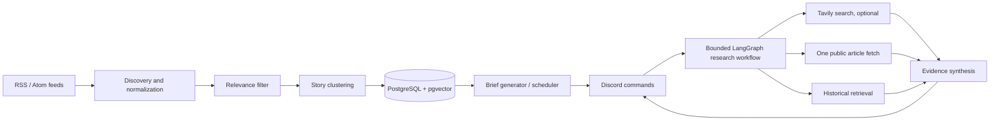

# NewsLens AI — Agentic AI News Intelligence Assistant

An agentic AI news intelligence assistant that discovers, clusters, investigates and contextualizes AI news using multiple sources, historical RAG and Discord.

**Project status:** working proof of concept. Model-based classification, synthesis, and embeddings require an OpenAI-compatible API key; independent web/news search requires a Tavily key. RSS ingestion, deterministic relevance fallback, story grouping, PostgreSQL persistence, lexical fallback retrieval, CLI commands, and mocked integration tests are designed to work without paid APIs.

## Project purpose

NewsLens is more than an RSS summary. It builds a traceable path from candidate articles through relevance filtering and event clustering to research, historical context, and a Discord briefing. Source provenance and uncertainty are preserved in the output.

## Screenshots

_Placeholder: add Discord screenshots after running the bot against a configured test server._

## Implemented

- Configurable interest profile, feed list, and primary/independent source-domain registry.
- Bounded RSS/Atom discovery, article normalization, URL canonicalization, deterministic relevance fallback, and date/title-based story grouping.
- PostgreSQL 17 + pgvector schema and Alembic migration for story/article history and vector retrieval.
- Optional OpenAI-compatible relevance, research planning, synthesis, briefing, and embeddings.
- LangGraph plan → retrieve → synthesize research workflow with bounded search/article/history tools.
- Optional Tavily search adapter; bounded public article fetch; citation IDs are validated against retrieved evidence.
- Historical retrieval using configured embeddings; deterministic lexical hashing works offline, but is not semantic embedding quality.
- Discord `/brief`, `/ask`, `/investigate`, and `/finland`, plus interval-based scheduled ingestion and briefing publication.
- Docker Compose, deterministic SQLite tests, evaluation case files, CI, security boundaries, and architecture docs.

## Planned / future

- Production-grade feed health and licensing review for a larger source catalog.
- Native API adapters for additional search providers and source registries.
- Research-run audit history, richer temporal comparisons, and a reviewed Finnish source set.
- Hybrid lexical/vector retrieval, relevance and clustering quality dashboards, and live model evaluations.
- Operational hardening, deployment secrets management, retries/backoff policies, and rate-limit coordination across replicas.

## Architecture



## How the automated pipeline works

1. Fetch configured RSS/Atom feeds with public-URL checks, redirects disabled, and a 2 MB feed cap.
2. Normalize each item, canonicalize its URL, and discard malformed/old entries.
3. Classify against `config/interests.yaml`; use an optional model or transparent deterministic fallback.
4. Group recent matching headlines into stories with token overlap and a 10-day window; the first version uses deterministic title similarity rather than an LLM.
5. Store story/article metadata, provenance, short snippets, and embeddings. Article bodies are not retained.
6. Generate a briefing from recent story records and publish it via `/brief` or the scheduler.

## Research agent and tools

The LangGraph workflow plans up to three focused queries, then runs a fixed set of tools:

- `news_search`: optional Tavily search, capped to five results per query.
- `investigate_url`: fetch one public HTTP(S) HTML/text page, without redirects and under the configured byte cap.
- `historical_retrieval`: nearest article embeddings from pgvector (or in-process cosine scoring on SQLite).

The workflow has no shell, write, arbitrary SQL, or general browser tools. It labels source relationships from configured domains, validates citations against retrieved evidence IDs, and communicates when evidence is missing. Without `OPENAI_API_KEY`, the workflow uses a bounded fallback plan and reports that model comparison was unavailable.

## Story clustering and evidence

Articles remain individually addressable and linked to an event-level story. The PoC matches token overlap in titles within ten days; this is explainable but can split paraphrases or merge similar events. Source types are `PRIMARY`, `INDEPENDENT_REPORTING`, `OTHER`, and `UNKNOWN`. The type describes relationship to the event, not reliability. Briefing and research output retain original URLs.

## Historical RAG

The migration creates `vector(1536)` plus an HNSW cosine index. With a configured embedding endpoint, NewsLens requests model embeddings. Without it, a stable hashed-token vector is stored and retrieval is lexical-like; do not describe that fallback as semantic understanding. Retrieval returns source titles, snippets, timestamps, source labels, and links.

## Discord commands

- `/brief` — run discovery, persist new relevant stories, and return the latest briefing.
- `/ask question:` — research a recent or historical AI/software news question.
- `/investigate url:` — fetch and investigate one public article URL.
- `/finland` — research current Finnish AI developments.

The bot syncs application commands on startup. Commands are disabled unless `DISCORD_ALLOWED_USER_IDS` contains one or more comma-separated Discord user IDs. Set `DISCORD_ALLOW_PUBLIC_COMMANDS=true` only if every member of the bot's servers should be able to run them. Set `DISCORD_BRIEF_CHANNEL_ID` to publish scheduled briefs. Without a channel ID, the scheduler still ingests but does not publish.

## AI Finland

The profile includes Finland/global geographies, the deterministic fallback recognizes common Finnish markers, and `/finland` issues a focused research request. This is a category capability, not a vetted Finland-only feed collection; add reviewed Finnish feeds and source domains before relying on its coverage.

## Technology stack

Python 3.12, Pydantic v2, LangGraph, discord.py, SQLAlchemy 2, Alembic, PostgreSQL/pgvector, httpx, feedparser, APScheduler 3, pytest, Ruff, Docker Compose.

The configurable provider uses the OpenAI-compatible Chat Completions endpoint with JSON Schema output and JSON-mode fallback, plus the embeddings endpoint. This request shape was checked against the [official Chat Completions API reference](https://developers.openai.com/api/reference/resources/chat/subresources/completions/methods/create) and [embeddings API reference](https://developers.openai.com/api/reference/resources/embeddings/methods/create). OpenAI currently recommends Responses for new OpenAI-only projects; Chat Completions is retained here to keep the adapter compatible with a broader range of OpenAI-compatible providers.

## Getting started

1. Install Python 3.12+, `uv`, and Docker Compose.
2. Copy `.env.example` to `.env`; adjust credentials and configuration as needed.
3. Install dependencies and start PostgreSQL:

   ```powershell
   uv sync --extra dev
   docker compose up -d db
   uv run newslens init-db
   ```

4. Try the pipeline and briefing:

   ```powershell
   uv run newslens ingest
   uv run newslens brief
   ```

5. For Discord, configure `DISCORD_BOT_TOKEN` and optionally `DISCORD_BRIEF_CHANNEL_ID`, then run `uv run newslens bot`.

For container execution, set `.env` and run `docker compose up --build`; the app service applies migrations before starting the bot. Use `docker compose up -d db` for database-only local development.

## Configuration and environment variables

| Variable | Purpose |
|---|---|
| `DATABASE_URL` | Async SQLAlchemy database URL; defaults to local PostgreSQL. |
| `POSTGRES_PASSWORD` | Compose-only local database password; change it and `DATABASE_URL` together when needed. |
| `OPENAI_API_KEY` | Optional token for an OpenAI-compatible chat and embedding API. |
| `OPENAI_BASE_URL` | Provider base URL, default `https://api.openai.com/v1`. |
| `OPENAI_CHAT_MODEL` | Configurable structured-output chat model. |
| `OPENAI_EMBEDDING_MODEL` | Embedding model; the initial schema is fixed to 1536 dimensions. |
| `TAVILY_API_KEY` | Optional bounded web/news search. Without it, RSS and historical context remain available. |
| `DISCORD_BOT_TOKEN` | Required to connect the Discord bot. |
| `DISCORD_BRIEF_CHANNEL_ID` | Optional channel ID for scheduled publication. |
| `DISCORD_ALLOWED_USER_IDS` | Comma-separated user IDs allowed to invoke commands; empty means deny all commands. |
| `DISCORD_ALLOW_PUBLIC_COMMANDS` | Explicit opt-in to allow every user to invoke commands; defaults to `false`. |
| `INTERESTS_FILE`, `FEEDS_FILE`, `PRIMARY_DOMAINS_FILE` | Paths to editable YAML configuration. |
| `NEWS_LOOKBACK_HOURS`, `BRIEF_INTERVAL_MINUTES` | Discovery/briefing windows. |
| `MAX_SEARCH_RESULTS`, `MAX_ARTICLE_BYTES`, `LOG_LEVEL` | Tool and runtime limits. |

## Tests and evaluations

Run `uv run ruff check .`, `uv run ruff format --check .`, and `uv run pytest`. Tests use SQLite, fake discovery/search providers, and no paid API credentials. `evals/` contains cases and behavioral expectations; these are not live model scores. Live AI evaluations are not implemented.

## Security and privacy

External URLs must be HTTP(S), resolve to public IPs, contain no credentials, and are fetched without redirects. Feed and article responses are byte-capped; HTML scripts/styles are discarded. Search tools, number of queries, and source counts are bounded. External text is treated as untrusted, escaped before Discord rendering, and is not stored in full. Model provider endpoints require HTTPS, except for loopback HTTP development endpoints. Discord commands deny access by default unless user IDs are allowlisted or public commands are explicitly enabled. `.env`, local secret directories, and common private-key files are ignored by Git.

When configured, research questions and selected source excerpts are sent to the configured model provider; search queries are sent to Tavily. Discord interactions and published briefings are processed by Discord. Do not submit personal or confidential information in research questions. News metadata, short snippets, summaries, and embeddings persist in PostgreSQL without automatic expiry; operators must define database backup and deletion policies. The database container port is bound to localhost in Compose. DNS validation and HTTP connection resolution are separate steps, so DNS-rebinding-resistant IP pinning remains future hardening. See [the privacy and security audit](docs/tietosuoja-ja-tietoturvatarkastus.md) for findings and remaining limits.

## Project structure

```text
newslens/            application package
  discovery/         RSS/Atom provider boundary
  persistence/       SQLAlchemy models/repository
  rag/               embeddings and retrieval helpers
  research/          LangGraph, bounded search, article fetch
  security/          URL validation and canonicalization
config/              interest, feed, and source-domain YAML
migrations/          Alembic schema
tests/               deterministic unit/integration tests
evals/                evaluation inputs and scenarios
docs/                 architecture, security, evaluation, and runbooks
```

## Limitations and roadmap

This is a PoC, not a newsroom or production service. Feed availability, source-domain labels, article layouts, and external provider APIs can change. Story grouping is title-based. Search and semantic model behavior require credentials. There is no live Discord/API test in CI, no persisted research-run audit table, and no multi-replica scheduler lock. Next steps: review source rights and feeds, add a verified Finnish feed set, test with PostgreSQL/Discord credentials, measure relevance and retrieval quality, and add durable scheduling/observability.

## Portfolio / interview explanation

**A — 30 seconds:** NewsLens is a Discord assistant that discovers AI news from feeds, groups related articles, researches questions against bounded web and historical sources, and publishes briefings with links. Deterministic code owns persistence and security limits; AI handles semantic classification and synthesis when configured.

**B — 1–2 minutes:** The app normalizes RSS/Atom entries, scores them against a YAML interest profile, groups related headlines into stories, and stores article provenance plus 1536-dimensional vectors in PostgreSQL/pgvector. Discord commands run a LangGraph plan/retrieve/synthesize workflow. It can use capped Tavily searches, fetch one public article page, and retrieve historical articles. Pydantic validates model output, citation IDs are allow-listed against evidence, and the output distinguishes primary, independent, and unknown source relationships. Without API credentials, deterministic fallbacks and fake-provider tests keep the vertical slice runnable.

**C — 3–5 minutes:** The design separates semantic work from control-plane work. `NewsDiscoveryProvider` turns configured feeds into normalized candidates. The interest classifier can use a structured model response but has a deterministic offline fallback; story linking uses an explainable, recency-bounded similarity function. SQLAlchemy stores event-level stories and article-level provenance, with an Alembic migration enabling pgvector and a cosine HNSW index. The LangGraph state machine has three steps: plan no more than three queries, gather from an optional search provider plus one URL fetch and history retrieval, then synthesize evidence into supported claims, uncertainty, disagreement, and analysis. Tool capabilities and network limits are ordinary Python code rather than model permissions. Discord exposes brief, ask, investigate, and Finland-specific research, with APScheduler for repeated discovery and publication. The repo includes deterministic SQLite tests and evaluation fixtures, while paid live evaluations and production operations are explicitly future work.
