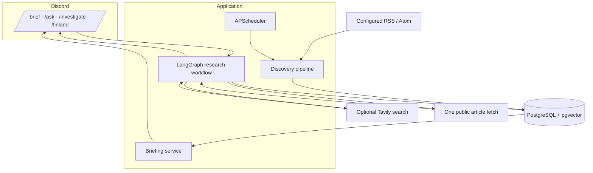
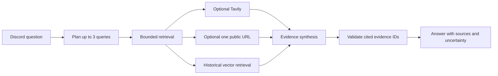
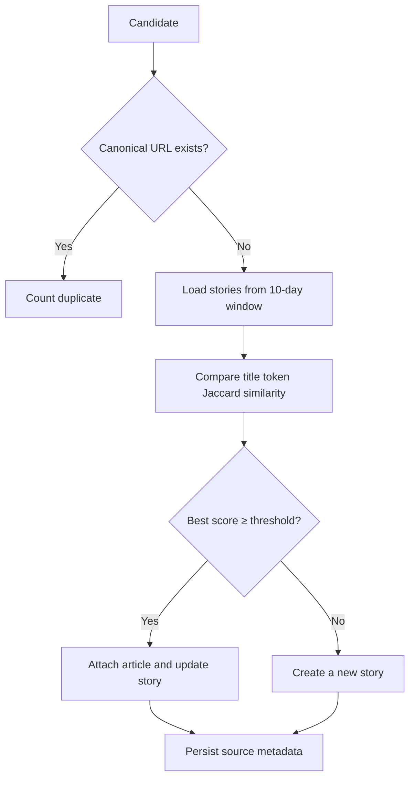
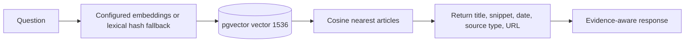

# Architecture

## Overall system

## Automated news pipeline

## Interactive research flow

## Story clustering flow

## Historical RAG flow

PostgreSQL is the target runtime. SQLite is used for deterministic test coverage; it scores vectors in Python. ORM metadata includes SQLite JSON fallback for the vector column, while the migration is PostgreSQL/pgvector specific.
