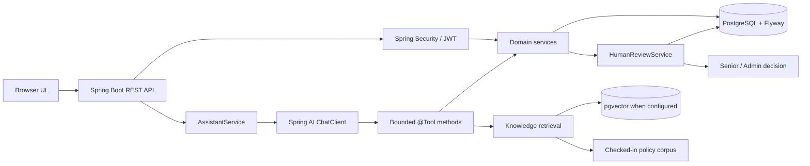

# SupportAI — Agentic Customer Support Assistant

A Java and Spring based AI assistant that helps customer support agents investigate tickets, search internal guidance, use bounded business tools, and propose actions with human oversight.

SupportAI is a support employee copilot, not a customer-facing chatbot. The LLM can select tools and summarize evidence. Java services enforce access, business rules, validation, audit, and state changes.

> **Proof of concept:** all included customers and tickets are fictional. Do not use this application with real customer records or expose it to the public internet.

## Implemented

- Java 21, Spring Boot 3.5, Spring AI 1.1, Spring Security, Spring Data JPA, PostgreSQL, and Flyway.
- JWT login with BCrypt password hashes and three RBAC roles.
- Assigned-ticket access for support agents; broader access for senior support and admins. The rule is enforced in application services used by both REST and AI tools.
- Ticket list, detail, history, customer-by-ticket, and orders-by-ticket APIs.
- Spring AI `ChatClient` with seven narrowly scoped tools and an eight-call request budget.
- Policy search over checked-in Markdown. When an OpenAI key and pgvector are available, documents are chunked and indexed with Spring AI embeddings; otherwise a local keyword search keeps the feature usable without a paid model call.
- Pending human review for the only supported state change, `CLOSE_TICKET`. A different senior/admin user must approve; deterministic Java then closes the ticket and writes history/audit events.
- Small browser UI for login, tickets, assistant chat, and human reviews.
- Correlation IDs, safe audit events, Actuator health/metrics, JUnit tests, a Testcontainers PostgreSQL integration suite, CI, and evaluation examples.

## Not implemented / future

- A live model smoke test passed, but broader tool behavior and quality evaluations have not been measured. Set `OPENAI_API_KEY` for model-backed chat and vector embeddings.
- No order refunds, credits, cancellations, outbound customer replies, ticket assignment controls, production identity provider, refresh-token revocation, rate limiting, or multi-tenant data model.
- `mvn verify` passed with five unit tests; three PostgreSQL Testcontainers integration tests were skipped because the Maven verification container did not have access to the Docker socket. Run the full suite in a Docker-capable Java 21 environment before relying on database integration behavior.

## Architecture



See [architecture](docs/architecture.md), [security](docs/security.md), and [privacy](docs/privacy.md) for trust boundaries and flow details.

## Technology

| Area | Choice |
|---|---|
| Runtime | Java 21 |
| Framework | Spring Boot 3.5.16 |
| Agent / RAG | Spring AI 1.1.8 |
| Persistence | Spring Data JPA, PostgreSQL 16, Flyway |
| Retrieval | Spring AI pgvector + OpenAI embeddings, with local keyword fallback |
| Authentication | Spring Security resource server, HMAC JWT, BCrypt |
| UI | Static HTML, CSS, and JavaScript served by Spring Boot |
| Tests | JUnit 5, Mockito, Testcontainers |
| Operations | Actuator, Micrometer, Docker Compose, GitHub Actions |

The Spring AI 1.1 release line supports Spring Boot 3.4/3.5; the project pins a stable patch pair rather than mixing Spring generations. See the [Spring AI 1.1 compatibility guidance](https://docs.spring.io/spring-ai/reference/1.1-SNAPSHOT/getting-started.html) and [Spring Boot 3.5 requirements](https://docs.spring.io/spring-boot/3.5/system-requirements.html). The default chat model, [GPT-5.4 Mini](https://developers.openai.com/api/docs/models/gpt-5.4-mini), supports Chat Completions and function calling. The default [text-embedding-3-small](https://developers.openai.com/api/docs/models/text-embedding-3-small) produces 1,536-dimensional embeddings, matching the pgvector configuration.

## Run locally

Requirements: Docker with Compose and Java 21 for local development. The checked-in Maven Wrapper downloads Maven 3.9.11 on first use. The container image builds with Maven and Java 21.

1. Copy `.env.example` to `.env` and set unique random values for `DB_PASSWORD` and `JWT_SECRET` (at least 32 bytes). Leave `OPENAI_API_KEY=supportai-disabled` for offline mode, or set a real key for live chat and vector retrieval. Never publish `.env`.
2. Start the application and database:

   ```powershell
   docker compose up --build
   ```

3. Open [http://localhost:8080](http://localhost:8080).

For database-only development, run `docker compose up -d db`, then from Java 21 run `.\mvnw.cmd spring-boot:run` in PowerShell or `bash ./mvnw spring-boot:run` on Unix.

Flyway creates the schema. At startup the application idempotently seeds the fictional demo users, customers, tickets, order, service statuses, and ticket histories. Hibernate uses `ddl-auto: validate`.

## Configuration

See [.env.example](.env.example). Secrets are supplied through environment configuration; do not commit `.env`.

| Variable | Purpose |
|---|---|
| `DB_URL`, `DB_USERNAME`, `DB_PASSWORD` | PostgreSQL connection |
| `JWT_SECRET` | HMAC signing key, minimum 32 bytes |
| `OPENAI_API_KEY` | Set to `supportai-disabled` for offline mode or to a real Spring AI chat/embedding key |
| `OPENAI_CHAT_MODEL` | Chat model name (default `gpt-5.4-mini`) |
| `OPENAI_EMBEDDING_MODEL` | Embedding model name (default `text-embedding-3-small`) |
| `DEMO_AGENT_PASSWORD` | Local demo account password |
| `DEMO_SENIOR_PASSWORD` | Local demo account password |
| `DEMO_OTHER_PASSWORD` | Local demo account password |

## Demo accounts

Defaults below are local demonstration credentials. Override all three passwords before sharing a running environment.

| Role | Email | Default password |
|---|---|---|
| Support agent | `agent@supportai.demo` | `AgentDemo123!` |
| Senior support | `senior@supportai.demo` | `SeniorDemo123!` |
| Other support agent | `other.agent@supportai.demo` | `OtherDemo123!` |

## Demo scenarios

1. Sign in as the support agent and investigate ticket **1001**. It includes an attempted password reset, ticket history, and a degraded authentication service.
2. Ask why the order in ticket **1002** has not arrived. Its order is delayed and policy explains the carrier escalation threshold.
3. Ask whether a service incident explains ticket **1003**. The authentication service is marked degraded.
4. Ask SupportAI to close ticket **1001**. It should create a pending review. Sign in as `senior@supportai.demo` and approve or reject it in **Human reviews**.
5. Sign in as the regular agent and request ticket **2002**. The backend returns the same not-found response used for an unknown ticket.

If no OpenAI key is configured, the assistant explains that model chat is offline; the REST/UI, authentication, seeded data, and review workflow remain usable.

## REST API

| Method | Path | Access |
|---|---|---|
| `POST` | `/api/auth/login` | Public; returns a bearer JWT |
| `GET` | `/api/tickets` | Authenticated; assignment-filtered for agents |
| `GET` | `/api/tickets/{id}` | Ticket service authorization |
| `GET` | `/api/tickets/{id}/history` | Ticket service authorization |
| `GET` | `/api/tickets/{id}/customer` | Customer derived from authorized ticket |
| `GET` | `/api/tickets/{id}/orders` | Orders derived from authorized ticket |
| `POST` | `/api/assistant/chat` | Authenticated; bounded tools |
| `GET` | `/api/reviews` | Agents see own proposals; senior/admin see all |
| `GET` | `/api/reviews/{id}` | Owner or senior/admin |
| `POST` | `/api/reviews/{id}/approve` | Senior/admin, not proposal author |
| `POST` | `/api/reviews/{id}/reject` | Senior/admin, not proposal author |
| `GET` | `/actuator/health` | Public health only |

Errors use a small JSON shape with timestamp, status, code, safe message, and request ID. Protected Actuator endpoints require admin.

## Agent, tools, and RAG

Spring AI supplies the tool-calling loop. The model receives only these tools for a request:

- `getTicket(ticketId)`
- `getTicketHistory(ticketId)`
- `getCustomerForTicket(ticketId)`
- `getOrdersForTicketCustomer(ticketId)`
- `checkServiceStatus(serviceName)`
- `searchKnowledgeBase(query)`
- `proposeTicketAction(ticketId, action, reason)`

Each ticket-bound tool calls `TicketService`, which resolves the authenticated actor and checks assignment before reading data. The model cannot query arbitrary customers, repositories, SQL, files, shells, or URLs. A request allows at most eight tool invocations.

Knowledge documents in [`src/main/resources/knowledge/`](src/main/resources/knowledge/) are split into bounded chunks and tagged with title/category/source metadata. When an OpenAI key is set, Spring AI indexes chunks in pgvector and uses embedding similarity; if embedding/vector retrieval is unavailable, a deterministic keyword fallback searches the same reviewed corpus. Retrieved text is evidence, never an instruction source.

## Tests and evaluations

```powershell
.\mvnw.cmd test
.\mvnw.cmd verify
```

On Unix, use `bash ./mvnw test` and `bash ./mvnw verify`.

Unit tests cover action policy, the tool-call budget, and ticket authorization. `SupportApiIntegrationTest` uses a pgvector Testcontainer to exercise login, assignment filtering, masked unauthorized access, and a pending-review/approval workflow. Integration tests are skipped when Docker is unavailable. Normal CI does not require an OpenAI key.

The evaluation examples in [`evals/tickets.jsonl`](evals/tickets.jsonl) describe tool and grounding expectations. They are a dataset, not measured results or an automated live-model evaluation. See [evaluation notes](docs/evaluation.md).

## Observability

- Every HTTP request receives or generates a validated `X-Request-Id`; the value is returned and included in the log pattern.
- Actuator exposes health, info, metrics, and Prometheus endpoints; all except health require admin authorization.
- The assistant records request/success/failure counters and a latency timer. Audit entries contain actor, tool/action, resource type/id, result, and timestamp; they exclude prompt text and model reasoning.
- Spring AI observability can contribute model/tool observations when a supported Micrometer registry/exporter is configured.

## Project layout

```text
src/main/java/com/supportai/     API, security, domain services, agent tools, RAG
src/main/resources/db/migration/ Flyway schema migrations
src/main/resources/knowledge/    Fictional internal support policies
src/main/resources/static/       Browser UI
src/test/                        Unit and Testcontainers integration tests
evals/                           AI/RAG/security evaluation examples
docs/                            Architecture, security, privacy, development, ADRs
```

## Limitations and roadmap

This PoC has one supported state change and a small static policy corpus. It has no production user provisioning, refresh tokens, token revocation, rate limits, fine-grained customer data classification, human review SLA, or deployment hardening. Future steps: run the full CI suite; tune and measure RAG/agent behavior with a live evaluation harness; add provider-neutral LLM configuration; add domain-specific authorization tests for each tool; add rate limiting and token revocation; and review database/audit retention for a production context.

## Portfolio explanation

**30 seconds:** SupportAI is a Java 21 and Spring support copilot. It lets an authenticated support employee investigate assigned tickets using Spring AI tools and internal policies. Java controls data access and business rules. If AI proposes closing a ticket, a different senior employee must approve before Java changes the status.

**Technical:** Spring Boot exposes a REST API and small browser UI. Spring Security issues HMAC JWTs after BCrypt authentication. Domain services enforce assignment rules and sit behind both REST controllers and Spring AI `@Tool` methods. Spring AI retrieves policy evidence from a pgvector store when embeddings are configured, with a local corpus search fallback. Flyway owns the PostgreSQL schema. Tests cover authorization and review policy; a Testcontainers suite covers the database-backed flows.

**Architecture:** A chat request enters the authenticated assistant service and passes a short user message to `ChatClient` with a fixed system policy and seven bounded tool callbacks. The model can ask for ticket details/history, ticket-scoped customer/orders, service status, knowledge search, or a close proposal. Tool callbacks call normal services, which resolve the actor from Spring Security and apply assignment checks. Knowledge retrieval searches chunked internal policy docs and returns source metadata. The write tool only creates a `PENDING` review. A senior/admin reviewer other than the proposer approves or rejects it; approval, review state, ticket close, history, and safe audit records happen through transactional Java services. The LLM never executes SQL or changes ticket state directly.
