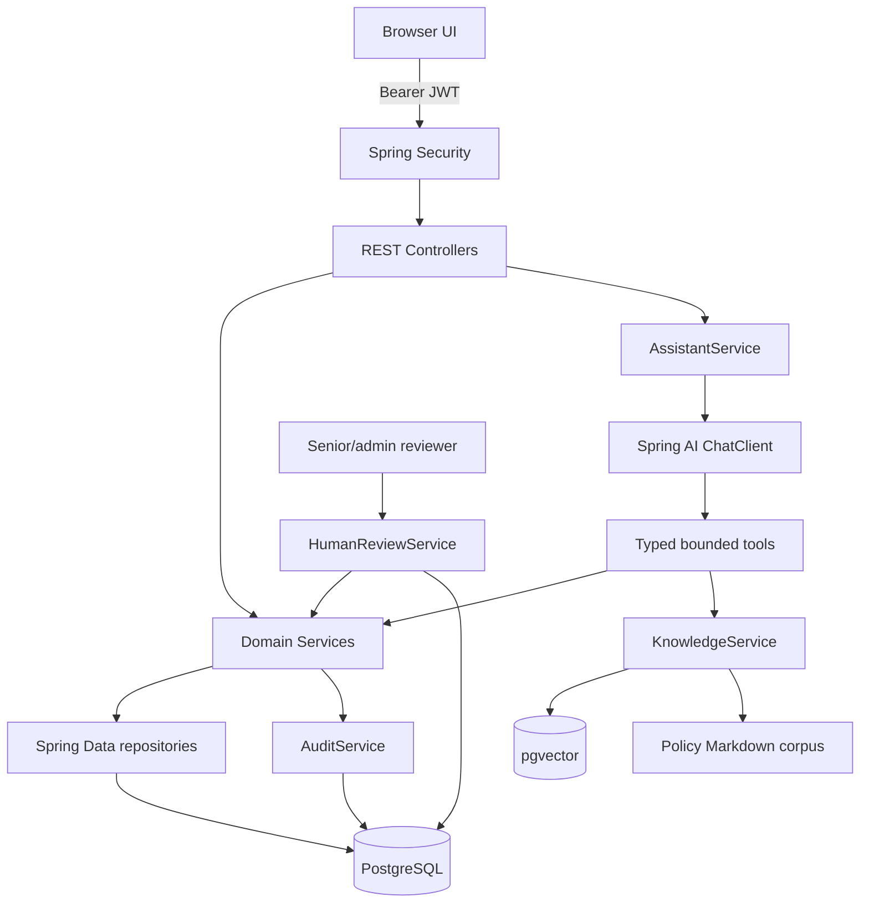
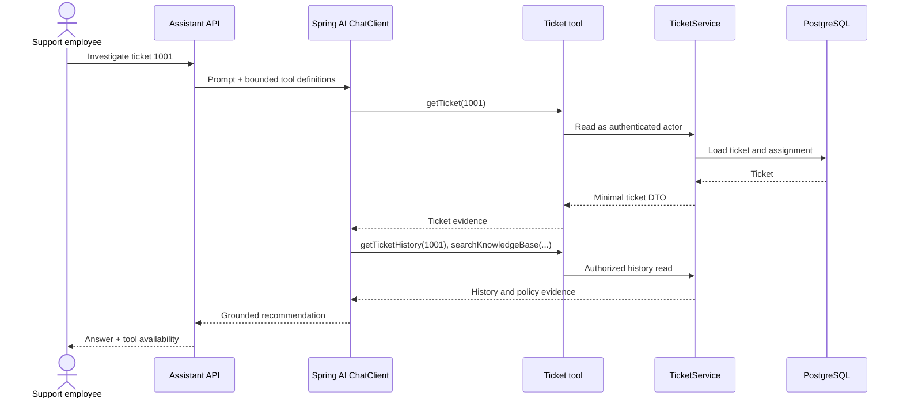
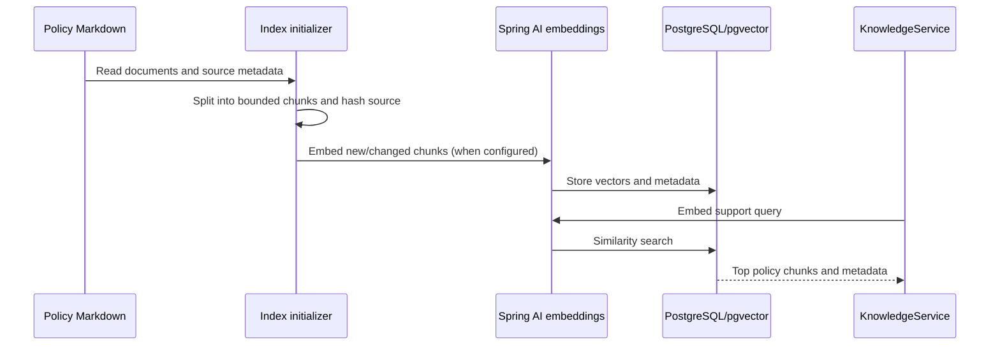
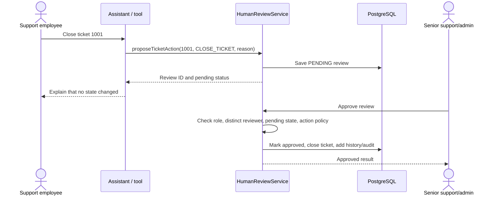

# Architecture

## 1. Purpose

SupportAI helps support employees investigate tickets with bounded application tools and internal support documents. It does not answer customers directly or give the LLM authority over application access or ticket state.

## 2. Domain model

- `AppUser` has an email, BCrypt password hash, and one of `SUPPORT_AGENT`, `SENIOR_SUPPORT`, or `ADMIN`.
- `Customer` is synthetic.
- `SupportTicket` has a customer, assignee, status, priority, description, and timestamps. Ticket IDs 1001–1003 are assigned to the regular demo agent; ticket 2002 is assigned to another user.
- `TicketEvent` records seeded history and deterministic ticket transitions.
- `CustomerOrder` belongs to a customer and includes tracking/status/estimated delivery data.
- `ServiceStatus` holds local synthetic service health.
- `HumanReview` stores a pending `CLOSE_TICKET` proposal, decision actor/note, and review timestamps.
- `AuditEvent` records safe actor/action/resource/result metadata without prompt contents or chain-of-thought.

## 3. Overall architecture

## 4. Java/Spring architecture

Controllers validate request shape and map to DTOs. Services perform authorization and business logic, then repositories access JPA entities. Tools are ordinary Spring components with Spring AI `@Tool` metadata; they invoke services and do not depend on repositories. Central exception handling maps domain/security/validation failures to safe JSON errors. Flyway migrations define schema; JPA uses validation mode.

## 5. Authentication

`POST /api/auth/login` delegates to Spring Security's `AuthenticationManager`, which verifies BCrypt hashes. The response contains an HMAC-SHA256 JWT with subject, issuer, issue/expiry timestamps, and role claims. The OAuth2 resource-server support validates bearer tokens and converts role claims to authorities. The PoC has no refresh or revocation endpoint.

## 6. Authorization

The current actor is resolved from the authenticated SecurityContext. A support agent can list assigned tickets and read only assigned tickets; an out-of-scope ticket is returned as not found to avoid confirming its existence. Senior support and admins can read all tickets. Customer and order access is derived from a ticket after its access check. Senior support/admin alone may decide reviews, and the proposer cannot approve or reject their own review. Controller role checks are defense in depth; core service checks remain authoritative.

## 7. Agent architecture and loop

`AssistantController` accepts a short message. `AssistantService` calls `ChatClient` with a fixed system prompt and the seven approved tool callbacks. Spring AI handles model/tool round trips. A request-scoped thread-local budget allows no more than eight service tool invocations; the framework tool error processor is configured to throw failures to the caller. A failure returns a generic assistant fallback instead of exposing stack details. A minimal live model smoke test passed; broader tool behavior still needs integration coverage.

The model gets only the selected ticket-derived information. It has no memory between requests in this PoC and is told to distinguish facts from recommendations, cite relevant internal sources, and say when evidence is missing. It never receives chain-of-thought.

## 8. Tool architecture

| Tool | Service boundary | Data/control |
|---|---|---|
| `getTicket` | `TicketService.getTicket` | Ticket DTO after assignment check |
| `getTicketHistory` | `TicketService.getHistory` | History after assignment check |
| `getCustomerForTicket` | `TicketService.getCustomerForTicket` | Minimal customer name/ID derived from ticket |
| `getOrdersForTicketCustomer` | `TicketService.getOrdersForTicketCustomer` | Orders derived from authorized ticket |
| `checkServiceStatus` | `ServiceStatusService.check` | Known status records only |
| `searchKnowledgeBase` | `KnowledgeService.search` | Internal docs with source metadata |
| `proposeTicketAction` | `HumanReviewService.propose` | Only close-ticket; creates pending review |

Tool calls are audited by safe tool/resource name. No tool accepts arbitrary customer IDs, SQL, repositories, file paths, shell commands, or URLs.

## 9. Ticket investigation flow

## 10. Order investigation flow

The assistant first retrieves the authorized ticket. `getOrdersForTicketCustomer(ticketId)` uses that ticket to derive the customer, then loads the customer's orders. There is no arbitrary `getCustomerOrders(customerId)` model interface. The assistant can combine the observed order status/tracking with delivery and delay policy.

## 11. RAG

Policy Markdown is loaded from `src/main/resources/knowledge/`, grouped into chunks up to roughly 1,100 characters, and tagged with document ID/title/category/source/version. If OpenAI embeddings and the pgvector store are configured, a startup initializer indexes chunks and `KnowledgeService` performs similarity search. A Flyway-owned ingestion registry avoids redundant indexing and lets changed chunks replace old vector IDs. If the model key/vector path is unavailable, a deterministic keyword ranking searches the same corpus. No retrieved document becomes an instruction or authorization source.

If semantic retrieval is unavailable, the vector steps are replaced by a corpus keyword search. The automated tests do not call external embeddings.

## 12. Human-in-the-Loop

The write policy lives in Java. The only supported action is `CLOSE_TICKET`; approval is performed in the review API by a different senior/admin user. Repeated decisions against a completed review fail.

## 13. Database

Flyway V1 creates users, customers, tickets, history, orders, service status, reviews, audit records, and knowledge-ingestion registry with foreign keys, constraints, and targeted indexes. The pgvector starter manages its own vector table/extension. Startup seed code idempotently creates synthetic demo rows. Hibernate `validate` checks entity mappings.

## 14. Audit

Events include actor, action/tool name, resource type and ID, result, and timestamp. Tool audit omits arguments except the resource identifier needed for traceability. Prompts, full tool outputs, model reasoning, tokens, passwords, hashes, and bearer credentials are excluded.

## 15. Observability

The request filter validates or generates `X-Request-Id`, includes it in response headers, and places it in MDC for logging. Actuator exposes health and protected info/metrics/Prometheus endpoints. Assistant request/success/failure counters and latency timer are recorded. Spring AI model/tool observations are available through its observation integration, though no exporter or live traces were verified in this environment.

## 16. Failure handling

Invalid requests produce generic 400 errors; unauthenticated requests get 401; forbidden actions get 403; missing or out-of-scope tickets get the same generic 404; illegal state transitions get 409. AI model/tool failures return a safe fallback. Knowledge retrieval falls back to local keyword search. The eight-call budget stops further Java tool execution. Database availability and migrations remain necessary for application startup.

## 17. Trust boundaries

- Browser input, ticket text, model output, and retrieved Markdown are untrusted.
- JWT is validated by the Spring resource server; roles come from signed claims.
- Domain services and PostgreSQL are trusted application boundary components.
- The model provider receives only request text and data returned by selected tools; a real deployment must assess provider retention and region policies.
- Human reviewers own state-changing approval.

## 18. Trade-offs

The project uses one application process and a small DTO/domain model to keep the vertical slice runnable. Service authorization is favored over controller-only checks so AI tool access inherits the same guard. The API uses a bearer JWT to keep UI/API simple, while the browser stores it in local storage, a PoC-only choice. Keyword fallback provides no-cost local behavior; vector search improves semantic retrieval only when embeddings are configured. The Spring AI 1.1 / Boot 3.5 line was selected because the project targets Java 21 and those versions are officially compatible; a future upgrade should target Spring AI 2.x and Boot 4.x together.

## 19. Future architecture

Potential next steps include external identity/OIDC, token revocation and key rotation, per-field sensitivity rules, robust rate/time budgets, streaming UX, feedback capture, model/provider abstraction, versioned policy ingestion, explicit evaluation gates, audit retention controls, and deployment-specific secrets/tracing.
